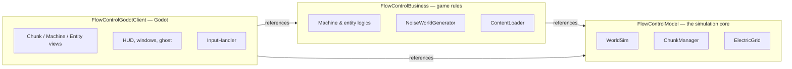
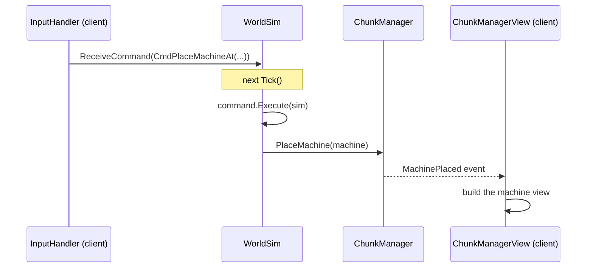
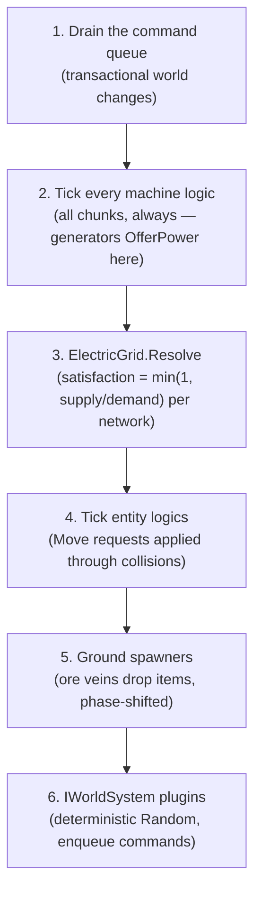
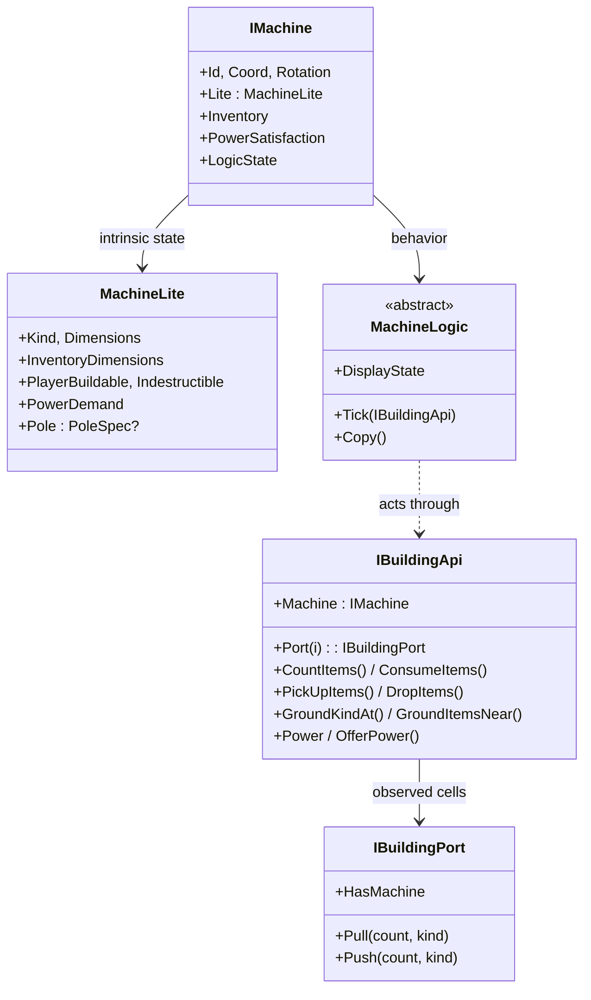
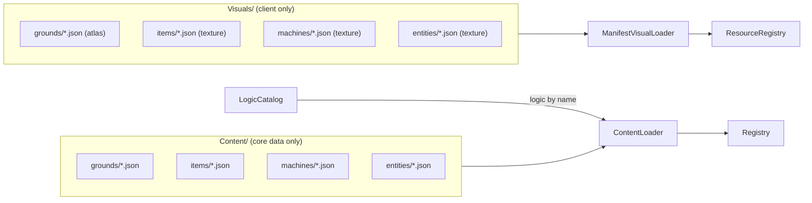

# Core architecture

FlowControl's simulation core is an **engine-free .NET library**: it references no game
engine, does no I/O and owns no wall clock. Everything the player sees in Godot is a thin
view over the model described here.

## The three projects



Dependencies point one way only. The model can run headless (the test suite runs it
under plain `dotnet test`), Business adds concrete behaviors and content loading,
and only the client knows Godot exists. Coordinates cross the client boundary through
`ModelConvert` extensions; the model uses its own primitives
(@FlowControlModel.Vec2, @FlowControlModel.Vec2I, @FlowControlModel.Rect, @FlowControlModel.RectI).

## One entry point: commands

The world is modified **only** through @FlowControlModel.WorldSimCommand objects queued
into @FlowControlModel.WorldSim (all concrete commands carry the `Cmd` prefix:
@FlowControlModel.CmdPlaceMachineAt, @FlowControlModel.CmdEntityStepById,
@FlowControlModel.CmdExchangeSlotWithHand, …). Views never mutate anything — they
subscribe to @FlowControlModel.World.IChunkManager events and redraw.



Commands carry an optional `actorId`: with it, the simulation enforces the player's
reach, consumes build costs from the hand/inventory and honors machine flags
(`playerBuildable`, `indestructible`). Without it, the command is a system command
(world bootstrap, tests, future order rewards).

## The tick pipeline

@FlowControlModel.WorldSim.Tick runs a fixed, deterministic pipeline. The client calls it
on a fixed timestep with catch-up; entity sprites are interpolated between the last two
tick positions, so the discrete steps below render smoothly.



## The world: chunks that never unload

@FlowControlModel.World.ChunkManager owns the spatial state: ground tiles, machines,
entities and ground items, split into fixed-size chunks
(@FlowControlModel.World.WorldGrid does the coordinate math).

Two invariants define the game's feel:

- **Chunks are permanent.** Once a chunk materializes it is never unloaded, and every
  machine in every chunk ticks forever — factories keep working off-screen. Only the
  client's chunk *views* load and unload around the camera.
- **Generation is deterministic.** `NoiseWorldGenerator` (Business) derives every tile
  from the seed: lakes, stone patches and ore veins each live on an independent noise
  channel. The same seed always produces the same world, which is what future
  save/load ("seed + diffs") and lockstep multiplayer stand on.

A machine registers in **every chunk it overlaps** (a flat id map ticks it exactly
once), ground properties (`passable`, `speedModifier`) plug into the same
`IsBoxFree` check that validates movement and placement.

## Machines and the building API



A machine is *intrinsic state* (@FlowControlModel.Machines.MachineLite — shared,
immutable, loaded from content) plus *extrinsic state* (coordinates, rotation,
inventory) plus a *logic* instance. Logics act on the world exclusively through
@FlowControlModel.Machines.IBuildingApi, which enforces two rules no logic
(or future player script) can break:

- **No conjuring** — every item transfer passes through the building's own inventory;
  ports pull/push, the ground gets drops from it and pick-ups into it.
- **Bounded reach** — world queries and ground interactions are limited to
  `MaxRange` cells around the footprint.

The in-game scripting language planned by the GDD will resolve `using` to this very
object, inheriting both rules for free. Entities mirror the design:
@FlowControlModel.Entities.EntityLogic acts through
@FlowControlModel.Entities.IEntityApi (movement requests, `MachinesNear`,
`PullFrom`/`PushTo` within range).

## Electricity

Poles (@FlowControlModel.Machines.PoleSpec) connect into networks when their centers
are within wire reach; a machine belongs to the network of the first pole whose supply
radius covers its footprint. Generators offer power during their tick
(`IBuildingApi.OfferPower`); after all machines ticked, the grid resolves each network:

```
satisfaction = min(1, offered supply / total demand)
```

Consumers read `IBuildingApi.Power` (0..1) on their next tick — one tick behind,
Factorio-style — and scale their work by it. Kinds registered without a `powerDemand`
always see 1, so electricity is strictly opt-in per machine kind.

## Items, inventories, the hand

@FlowControlModel.Inventories.Inventory has three sections — `input`, `blob`, `output`.
External insertion fills input→blob, external extraction drains output→blob; a machine
consuming its own fuel/ingredients uses the owner path that reaches the input section.
An optional `InsertFilter` lets recipe machines reject foreign items — ports respect it
without losing items.

The player interacts through a **cursor slot** (`IEntity.HandStack`): clicking any
inventory slot issues @FlowControlModel.CmdExchangeSlotWithHand with Factorio click
semantics (take / put / merge / swap), and buildings are placed from the hand.

## Content is data



One JSON file per kind; the file name **is** the kind. `Content/` holds only what the
core needs (dimensions, inventories, logic bindings with `logicParams`, power fields);
the mirrored `Visuals/` tree holds textures and atlas coordinates. There are no
built-in kinds — even the player is `Content/entities/player.json`. Mods are extra
files dropped into the trees. Validation is fail-fast in both directions: unknown
logics, machines without an item pair, missing textures and orphan visuals all throw
at startup with the kind name in the message.

## Determinism checklist

Everything above is deterministic on purpose — the foundation for save/load
(seed + diffs) and lockstep multiplayer:

- one seed drives world generation and the gameplay @FlowControlModel.IWorldContext.Random;
- machines and poles are processed in id order; spawners are phase-shifted by cell hash;
- entity randomness (`Wanderer`) is seeded per entity id;
- commands are the only mutation channel and are serializable by construction.
